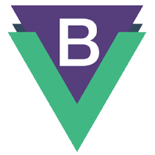
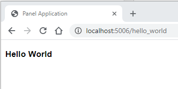

# panel-components

[Panel](https://panel.holoviz.org) is a powerful 💪 framework for creating awesome analytics apps in Python 🐍 using the tools you know 🧠 and love ❤️.

<table>
<td><a href="https://awesome-panel.org" target="_blank"><image src="assets/images/panel_dashboard.png" style="height:150px"/></a></td>
<td><a href="https://panel.holoviz.org/gallery/links/deck_gl_json_editor.html#links-gallery-deck-gl-json-editor" target="_blank"><image src="assets/images/panel_deckgl.png" style="height:150px"/></a></td>
<td><a href="https://awesome-panel.org" target="_blank"><image src="assets/images/panel_detr.png" style="height:150px"/></a></td>
</table>

The purpose of the `panel-components` package is to enable users of Panel to create data applications with a modern look and feel by making it easy to integrate with

- modern front end frameworks like [Vue.js](https://vuejs.org/) and [React](https://reactjs.org/).
- Component libraries like [Bootstrap Vue](https://bootstrap-vue.org/), [Material UI](https://material-ui.com/), [Shoelace](https://shoelace.style/) and [Fast](https://www.fast.design/).
- Any awesome .js library for data visualization and exploration.

<table>
<td><a href="(https://bootstrap-vue.org/)" target="_blank"></a></td>
<td><a href="(https://material-ui.com/)" target="_blank"></a></td>
<td><a href="https://fast.design" target="_blank"><svg style="height:50px" xmlns="http://www.w3.org/2000/svg" class="icon icon-brand" viewBox="0 0 140 123"><path fill-rule="evenodd" clip-rule="evenodd" d="M124.787 64.442l-4.98-.636c-.885-.113-1.691.514-1.839 1.393A40.326 40.326 0 0155.29 91.674c-2.462-1.7-1.57-5.286 1.32-6.06l21.06-5.643a3.318 3.318 0 10-1.717-6.41l-27.098 7.261c-.07.019-.14.036-.211.052l-12.779 3.424a.897.897 0 01-.083.027 3.318 3.318 0 101.717 6.41l.29-.078c1.99-.533 4.09.151 5.523 1.63a48.582 48.582 0 0038.695 14.632 48.577 48.577 0 0044.151-40.674c.142-.88-.486-1.69-1.371-1.803zM23.479 60.166a5.439 5.439 0 00-.533.115l-10.423 2.793a3.318 3.318 0 11-1.718-6.41l15.957-4.276c2.048-.548 3.547-2.27 4.003-4.34a48.57 48.57 0 0124.618-32.436 48.577 48.577 0 0159.093 10.57c.594.666.499 1.686-.187 2.257l-3.857 3.213-1.237 1.03c-.003.002-.006.002-.009 0a40.323 40.323 0 00-68.139 10.145c-1.16 2.754 1.449 5.345 4.336 4.572l2.222-.596a3.318 3.318 0 011.718 6.41l-7.667 2.054a5.35 5.35 0 00-.515.167l-17.662 4.732z" fill="#FF4387"></path><rect x="69.904" y="56.905" width="6.636" height="16.454" rx="3.318" transform="rotate(75 69.904 56.905)" fill="#FF4387"></rect><rect x="48.333" y="62.703" width="6.636" height="49.768" rx="3.318" transform="rotate(75 48.333 62.703)" fill="#FF4387"></rect><rect x="94.364" y="50.565" width="6.636" height="19.829" rx="3.318" transform="rotate(75 94.364 50.565)" fill="#FF4387"></rect><path fill-rule="evenodd" clip-rule="evenodd" d="M97.725 51.927c3.022 11.276 14.612 17.967 25.888 14.946 11.275-3.022 17.967-14.612 14.946-25.887-3.022-11.276-14.612-17.968-25.888-14.946-11.275 3.021-17.967 14.611-14.946 25.887zm20.425 9.448c8.429 0 15.262-6.684 15.262-14.93 0-8.246-6.833-14.93-15.262-14.93s-15.262 6.684-15.262 14.93c0 8.246 6.833 14.93 15.262 14.93z" fill="#FF4387"></path></svg></a></td>
</table>

The panel-components package does this by providing

- A general framework for creating html components for Panel. See [component.py](panel_components/component.py).
  - This includes html components based on Vue or React.
- The basic [HTML5](https://www.w3schools.com/html/default.asp) components. See [tags.py](panel_components/tags.py).
- A [Vue.js](https://vuejs.org/) component. See [vue.py](panel_components/vue.py).

## License

Licensed under the Apache License, Version 2.0

## Getting Started

### Installation

You can install via pip.

- `pip install panel-components`.

Installing via

- `pip install -e git+https://github.com/paulopes/panel-components.git` or
- `conda install`

is currently not supported.

### Examples

#### Hello World

Let's try a **Hello World** example.

**File**: `hello_world.py`

```python
from panel_components.tags import h1

layout = h1("Hello World")

layout.servable()
```



#### panel-bootstrap-vue

The [panel-bootstrap-vue](https://github.com/paulopes/panel-bootstrap-vue) package wraps the [Bootstrap Vue](https://bootstrap-vue.org/) component library and enables integration with Panel.

## Contributing

### Developer Instructions

In order to install this repo for development you should

- Fork it
- Git clone your Fork
- Create a virtual environment in the root of the project folder

```bash
python -m venv .venv
```

- Activate it via `source .venv/Scripts/activate` for git bash on windows and similar commands in other environments.
- `pip install panel`.
- Set your PYTHONPATH to the project root.

There are currently no tests with which you can verify everything is working.
